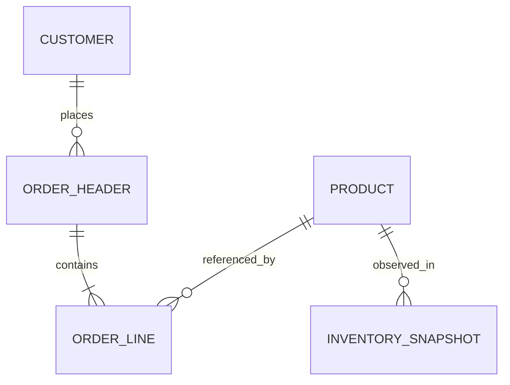

# P1-U1 Domain Entities and Source Schema

## Source Contract Summary
The generator writes five related synthetic CSV entities under `lakehouse/source/`: customers, products, order headers, order lines, and daily product inventory snapshots. All keys are stable strings; dates use ISO `YYYY-MM-DD`; numeric values use canonical decimal/integer formatting. Exact CSV headers are the published contract consumed by P1-U2.

## Entity Definitions

### Customer
- **Grain**: One record per synthetic customer.
- **Primary key**: `customer_id`.
- **Candidate fields**:
  - `customer_id` — stable synthetic key such as `CUST-000001`.
  - `customer_name` — synthetic label such as `Customer 000001`; no realistic personal identity.
  - `customer_segment` — documented finite segment category.
  - `region` — documented synthetic region category.
  - `acquisition_channel` — documented finite channel category.
  - `acquisition_date` — date in configured window and no later than the customer's first order.
  - `customer_status` — documented active/inactive-style synthetic category if required by profile use cases.

### Product
- **Grain**: One record per synthetic product.
- **Primary key**: `product_id`.
- **Candidate fields**:
  - `product_id` — stable synthetic key such as `PROD-000001`.
  - `product_name` — synthetic catalog label such as `Product 000001`.
  - `category`, `subcategory` — documented finite categories with consistent parent mapping.
  - `list_price` — nonnegative decimal reference price.
  - `reorder_point` — nonnegative inventory threshold.
  - `product_status` — documented finite product state.

### Order Header
- **Grain**: One record per synthetic order.
- **Primary key**: `order_id`.
- **Foreign key**: `customer_id` references Customer.
- **Candidate fields**:
  - `order_id` — stable synthetic key such as `ORD-000001`.
  - `customer_id` — existing customer key.
  - `order_date` — date in configured window.
  - `order_status` — finite domain including completed and non-completed examples.
  - `payment_method` — documented synthetic category.
  - `channel` — documented sales channel category.

### Order Line
- **Grain**: One record per product line within an order.
- **Primary key**: `order_line_id`.
- **Foreign keys**: `order_id` references Order Header; `product_id` references Product.
- **Candidate fields**:
  - `order_line_id` — stable synthetic key such as `LINE-000001`.
  - `order_id`, `product_id` — existing parent keys.
  - `quantity` — positive integer.
  - `unit_price` — nonnegative decimal captured for the transaction.
  - `discount_rate` — decimal in the documented allowable interval; downstream discount amount derivation is defined with Gold measures.
- **Volume**: Exactly the configured order-line count (default 100,000). Order headers are generated by assigning one or more lines to each order; the resulting header count is recorded in the manifest.

### Daily Inventory Snapshot
- **Grain**: One record per product per calendar date in the configured range.
- **Primary key**: Composite `(snapshot_date, product_id)`.
- **Foreign key**: `product_id` references Product.
- **Candidate fields**:
  - `snapshot_date` — every calendar day in the configured inclusive range.
  - `product_id` — existing product key.
  - `inventory_on_hand` — nonnegative integer quantity.
  - `reorder_point` — nonnegative integer threshold applicable to the snapshot.
- **Volume**: Configured product count multiplied by the inclusive number of calendar days (1,096 days at the default 2023-2025 window, including leap day 2024; 1,096,000 rows for 1,000 products).

## Relationships

Text alternative: a customer places zero or more orders; each order belongs to one customer and contains one or more lines; each order line references one product; each product has one inventory snapshot per configured calendar date.

## Manifest Entity
One generation manifest describes a complete generation run. It records schema version, seed, effective date range, requested and actual entity counts, CSV file paths, checksums, validation results, scenario-presence results, and a run timestamp. The timestamp is operational metadata and is not part of the logical-row reproducibility comparison.

## Downstream Use
- Order headers preserve customer, date, status, payment method, and channel context.
- Order lines provide the sales transaction grain and product/quantity/price/discount inputs.
- Customer and product entities provide dimension attributes for the Gold dimensional model.
- Daily snapshots provide direct inventory history for Gold inventory facts and low-stock scenario analysis.
- All source keys and relationships are stable and documented for Bronze ingestion and lineage.
