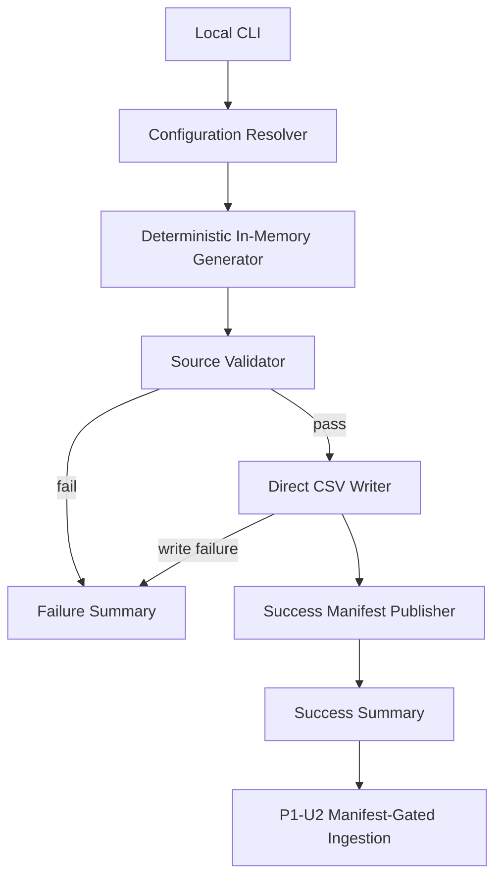

# P1-U1 Logical Components — NFR Design

## Component Set

| Logical component | Responsibility | NFR behavior |
|---|---|---|
| Local CLI / Run Coordinator | Accept the generation command, invoke configuration/generation/validation/output in order, and report status | Fail fast; no automatic retry. Report actionable errors and elapsed run duration/row counts. |
| Configuration Resolver | Load defaults and overrides, resolve source output paths, validate dates/positive sizes/seed | Reject invalid settings before entity generation or file publication. |
| Deterministic In-Memory Generator | Build customer, product, order, order-line, and daily inventory collections from effective settings | Use seed `42` by default and fixed effective dates; stable IDs/order; memory use scales with requested dataset size. |
| Source Validator | Check entity counts, keys/references, domain rules, and required scenario presence against generated collections | Run before CSV publication; validation failure returns a failed run and no success manifest. |
| Direct CSV Writer | Serialize validated entity collections to the five configured source paths | Write stable schema/row/column order and canonical values. No staging, backup, rollback, or prior-run preservation. A local write failure may leave partial/unmanifested files. |
| Success Manifest Publisher | Write run metadata after all CSV outputs complete successfully | Final success marker only; includes effective configuration, schema version, output paths, counts, checksums, and validation outcomes. Never publish on failure. |
| Run Summary | Present outcome to developer | On success, report effective settings, row counts, and elapsed duration. On failure, report stage/error and that no valid manifest was published. |

## Control Flow
1. CLI receives the command and starts the run timer.
2. Configuration Resolver validates settings and resolves paths.
3. Deterministic In-Memory Generator builds all configured entity collections.
4. Source Validator checks the complete generated collections.
5. If valid, Direct CSV Writer writes each CSV to its configured source path.
6. After every expected CSV is successfully written, Success Manifest Publisher writes the manifest last.
7. Run Summary reports success/counts/duration; any failure exits without manifest publication and is reported to the caller.
8. P1-U2 validates the manifest and its files/checksums before accepting source inputs.

## Data/Control Diagram

Text alternative: the CLI validates settings, generates all records in memory, validates the complete source set, writes CSVs directly, and publishes the manifest last. Any failure reports an error and leaves the run unaccepted; downstream Bronze ingestion requires a valid manifest.

## Logical and Infrastructure Boundaries
- All components run in one local Python process; components are logical modules, not independently deployed services.
- Filesystem CSVs and the manifest are the only P1-U1 persistence boundary.
- There is no network access, hosted service, database server, queue, cache, retry manager, or backup/restore component.
- The Data Engineer owns operations and manually reruns after resolving a failure; P1-U2 does not consume files without a valid manifest.

## Known Trade-Off
Materializing all entity collections in memory is the user's selected simple approach. At default size it includes 1,096,000 inventory rows; higher configurable sizes can consume substantial memory or fail. There is no fixed memory/scale guarantee, and no automatic streaming fallback. Any later change to streaming, staging, retries, or preservation guarantees requires revisiting the approved design/NFRs.
