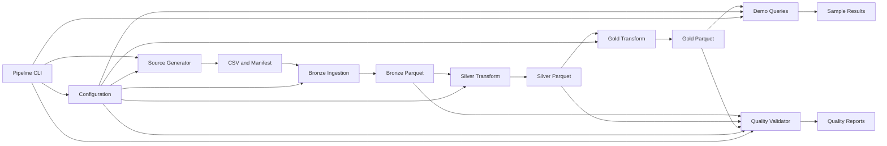

# Phase 1 Component Dependencies and Data Flow

## Dependency Matrix

| Component | Depends on | Provides to | Communication |
|---|---|---|---|
| Configuration and Path Resolver | User defaults/configuration and repository paths | CLI and all stages | Immutable configuration and local paths |
| Pipeline CLI and Orchestrator | Configuration; stage interfaces | Generator, ingestion, transformations, validators, demo queries | In-process function calls; stage selection and ordering |
| Synthetic Source Generator | Configuration and seed | Bronze Ingestion | CSV files and source manifest under `lakehouse/source/` |
| Bronze Ingestion | Configuration; source CSV/manifest | Transformation Runner and Quality Validator | Bronze Parquet files under `lakehouse/bronze/` plus load metadata |
| Silver/Gold Transformation Runner | Configuration; Bronze Parquet; SQL assets | Quality Validator and downstream consumers | Silver/Gold Parquet layer contracts |
| Data Quality Validator | Configuration; source or layer outputs | Orchestrator and report consumers | Named check results and persisted reports |
| Gold Query and Demo Helpers | Configuration; Gold Parquet | Analytics consumer and acceptance evidence | DuckDB query results and sample outputs |

## Data-Flow Diagram

## Text Alternative
1. Configuration supplies seed, dataset settings, and paths to the CLI and stages.
2. The generator creates CSV inputs and a manifest in `lakehouse/source/`.
3. Bronze ingestion reads those files, writes Parquet to `lakehouse/bronze/`, and captures load metadata.
4. DuckDB SQL transforms Bronze inputs into Silver Parquet, then Gold Parquet, under their respective layer directories.
5. The quality validator checks each applicable boundary and reports outcomes to orchestration; failed critical gates stop dependent work.
6. Demo queries read Gold Parquet and produce sample result evidence.

## Dependency and Ownership Rules
- Dependencies flow from source to Bronze to Silver to Gold; no component calls backward into a later layer.
- The CLI owns sequencing, but stage modules own their internal processing.
- Cross-stage exchanges use documented CSV/Parquet contracts and paths, not shared mutable in-memory datasets.
- The same data engineer executes and integrates every dependent component in order. Check the source/Bronze contract before Silver/Gold mapping and validate the Gold contract before Phase 2 handoff.
- A DuckDB connection is a stage-local resource; it is not a separately hosted service or cross-stage dependency.
