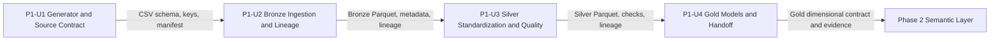

# Phase 1 Unit Dependencies and Handoffs

## Dependency Matrix

| Unit | Story | Depends on | Input contract | Exit handoff | Start rule |
|---|---|---|---|---|---|
| P1-U1 — Synthetic generator/source contract | P1-US-1 | None | Approved Phase 1 requirements and synthetic-data decisions | Deterministic CSV entities, manifest, schemas/keys, config and run evidence | Start first; no upstream dependency |
| P1-U2 — Bronze ingestion/lineage | P1-US-1 | P1-U1 | U1 CSV schema, keys, manifest and local source paths | Bronze Parquet, metadata, counts, lineage and ingestion evidence | Start only after U1 handoff checks pass |
| P1-U3 — Silver standardization/quality | P1-US-2 | P1-U2 | Accepted Bronze schemas, keys, paths and metadata | Typed Silver Parquet, quality policies/results and lineage | Start only after U2 handoff checks pass |
| P1-U4 — Gold models/samples/handoff | P1-US-2 | P1-U3 | Accepted Silver schema, keys, lineage and quality outcomes | Gold dimensional contract, sample queries/results, final quality and Phase 2 handoff | Start only after U3 handoff checks pass |

## Execution and Integration Rules
1. One data engineer owns and executes P1-U1 -> P1-U2 -> P1-U3 -> P1-U4; no parallel developer ownership is assumed.
2. Each unit publishes its concise output/contract/quality checklist and a representative command or result.
3. The next unit does not begin contract-dependent work if its predecessor's acceptance or contract check fails.
4. Resolve the mismatch in the owning unit, rerun that unit's checks, and publish a passing handoff before proceeding.
5. Unit handoffs use documented CSV/Parquet paths; communication is local and file-based. No network/service dependency exists.
6. Final phase acceptance is an end-to-end check from source generation through Gold and sample queries, followed by publication of the Gold contract for Phase 2.

## Dependency Diagram

## Text Alternative
P1-U1 generates and documents deterministic source CSV. P1-U2 consumes that accepted contract and publishes Bronze Parquet. P1-U3 consumes accepted Bronze and publishes typed, validated Silver. P1-U4 consumes accepted Silver and publishes Gold dimensional models, sample-query evidence, and the Phase 2 handoff. Each arrow is a blocking acceptance gate owned by the same data engineer.
