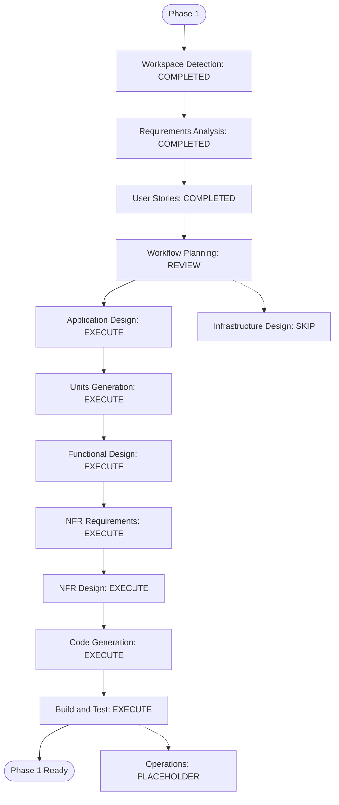

# Phase 1 AI-DLC Execution Plan

## Detailed Analysis Summary

### Scope and Impact
- **Project type**: Greenfield implementation in a requirements-only workspace.
- **Active scope**: Phase 1 — synthetic e-commerce data and Bronze/Silver/Gold lakehouse models. Later PoC phases are out of scope for this plan except for the Gold contract handoff.
- **User-facing impact**: Indirect, through analytics consumers and downstream BI/semantic consumers of the Gold datasets.
- **Structural impact**: New Python/DuckDB processing code and a separate repository-root `lakehouse/` artifact layout are expected during implementation.
- **Data-model impact**: Yes. Establish synthetic source contracts, layer schemas, sales/customer/inventory models, and a forecast baseline.
- **API impact**: None in Phase 1.
- **NFR impact**: Reproducibility, local runtime, data quality, inspectability, and the configured dataset volume need explicit design and validation.
- **Components affected**: Synthetic source generator, CSV input, Bronze ingestion, DuckDB SQL transformations, Silver/Gold Parquet outputs, tests, documentation, and Phase 2 handoff.

### Component Relationships
- **Primary flow**: Python generator -> synthetic CSV source -> Bronze ingestion -> DuckDB Silver transformations and quality checks -> Gold sales/customer/inventory datasets -> sample queries and Phase 2 schema handoff.
- **Ownership**: One data engineer owns all components, stories, units, tests, and integration; dependent slices are sequenced, not parallelized.
- **Candidate sequence for Units Generation to detail**: P1-U1 generator/source contract -> P1-U2 Bronze ingestion/lineage -> P1-U3 Silver transformations/quality -> P1-U4 Gold models/sample queries/handoff.

### Risk Assessment
- **Risk level**: Medium — several related data contracts, business measures, and grains must align, but the data is synthetic and local.
- **Rollback complexity**: Low to moderate — generated artifacts can be recreated; preserve reproducible inputs/configuration and avoid silently replacing prior source snapshots during a run.
- **Testing complexity**: Moderate — verify deterministic generation, key integrity, transformation quality, Gold grains, and end-to-end sample analysis.

## Workflow Visualization

### Mermaid Diagram

### Text Alternative
1. Completed: Workspace Detection, Requirements Analysis, and User Stories.
2. Await Workflow Planning approval.
3. If approved, execute Application Design, Units Generation, Functional Design, NFR Requirements, NFR Design, Code Generation, then Build and Test.
4. Skip Infrastructure Design; Operations remains a future placeholder.

## Phases to Execute

### INCEPTION
- [x] Workspace Detection — completed; greenfield implementation.
- [x] Reverse Engineering — skipped; no application source code exists.
- [x] Requirements Analysis — completed and approved.
- [x] User Stories — completed and approved; two outcome-led stories, one data engineer.
- [ ] Workflow Planning — in progress; this plan awaits user approval.
- [ ] Application Design — EXECUTE. Define the generator/ingestion/transformation/modeling responsibilities, repository-root artifact layout, contracts, and relationships before decomposition.
- [ ] Units Generation — EXECUTE. The user explicitly requested units and slices; formalize unit boundaries, dependencies, handoffs, and sequential ownership for one engineer.

### CONSTRUCTION
- [ ] Functional Design — EXECUTE. New schemas, business measures, data-quality policies, inventory coverage/velocity, and forecast behavior require explicit definition.
- [ ] NFR Requirements — EXECUTE. Make reproducibility, local run expectations, data volume, inspectable quality results, and testability verifiable for this PoC.
- [ ] NFR Design — EXECUTE. Translate accepted NFRs into practical local design choices and checks; avoid production-scale architecture.
- [ ] Infrastructure Design — SKIP. The runtime is native/local and does not provision infrastructure or require a container runtime.
- [ ] Code Generation — EXECUTE (always). Plan and implement approved units sequentially, including tests and documentation.
- [ ] Build and Test — EXECUTE (always). Validate unit behavior, integrated layer flow, sample business queries, and Phase 1 acceptance evidence.

### OPERATIONS
- [ ] Operations — PLACEHOLDER. Deployment/monitoring workflow is not part of this PoC's current phase.

## Stage Count and Coordination
- **Total remaining stages recommended for execution after this plan is approved**: 7 — Application Design, Units Generation, Functional Design, NFR Requirements, NFR Design, Code Generation, Build and Test.
- **Stages recommended to skip**: Infrastructure Design. Reverse Engineering was skipped during workspace detection.
- **Execution mode**: Single-owner sequential slices. No developer-to-developer parallel dependencies are assumed.
- **Coordination checkpoints**: Confirm generated schemas/keys/configuration before Bronze work; validate the Bronze contract before Silver/Gold mappings; run end-to-end integration before publishing the Phase 2 Gold contract.
- **Timeline**: Not estimated at this planning stage; one-person effort, tool setup, and data-quality findings have not yet been sized. Estimate during unit/code planning.

## Success Criteria
- A seeded, configurable generator creates reproducible synthetic inputs and repeatable Bronze outputs.
- Silver transformations apply documented types and data-quality rules with inspectable results.
- Gold sales, customer, daily product inventory, and forecast outputs meet documented grains and support the sample use cases.
- A local end-to-end generator-to-Gold run and sample query evidence satisfy Phase 1 acceptance without Docker, WSL, or another container runtime.
- Phase 2 receives a stable Gold contract: schemas, keys, grains, measure derivations, paths, lineage, and examples.

## Approval Gate
Please review this plan. You may request changes, ask to include the skipped Infrastructure Design stage, or approve and continue to Application Design. No later stage begins until the workflow plan is explicitly approved.
