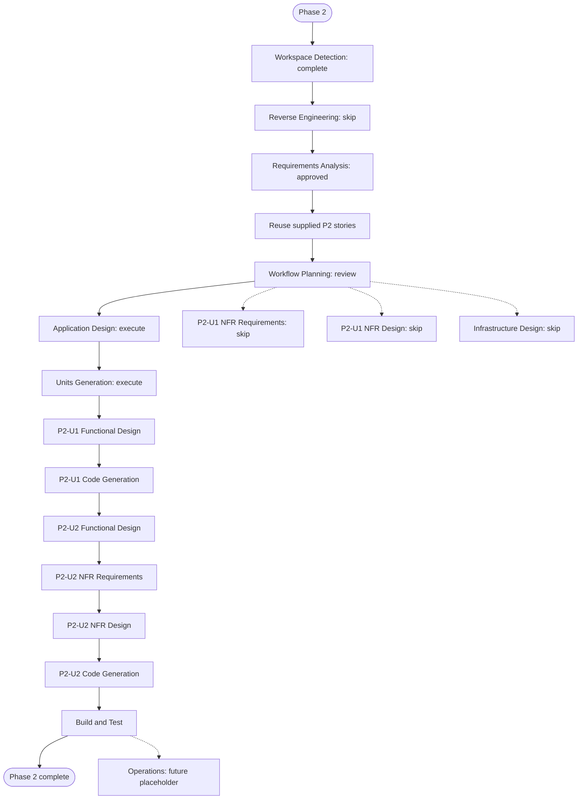

# Phase 2 Execution Plan — Semantic Layer

> **Scope amendment (2026-09-30):** The earlier Cube/MCP/SQL execution plan is superseded by the user's approved REST-over-Gold direction. Current execution is limited to the local Gold catalogue, schema, documented relationships, and bounded query API; see [P2-U2 code-generation plan](../../construction/plans/p2-u2-code-generation-plan.md). No further Cube startup, SQL API, MCP adapter, or cross-interface parity work is required for this delivery.

## Detailed Analysis Summary

### Scope and Impact
- **Project type**: Brownfield extension of the completed Phase 1 local lakehouse.
- **Active scope**: Correct the Gold contract where required, then provide an open-source local Cube Core semantic layer and REST, MCP, and SQL-compatible access with parity evidence.
- **User-facing impact**: Analytics and agent consumers gain governed catalog discovery and query access; no dashboard is in scope.
- **Structural impact**: Add the smallest local Cube Core configuration/model and only the adapter needed for a required interface if Cube Core does not provide it locally.
- **Data-model impact**: Correct completed-order sales eligibility and inventory velocity/coverage calculations; map Gold grains, dimensions, and metrics into Cube definitions.
- **API impact**: Add REST, MCP, and SQL-compatible query access, with one canonical semantic definition.
- **NFR impact**: Enforce the approved local-only, open-source, no-container, safe-query, and secret-handling constraints. No performance SLO, HA, or monitoring system is required for this PoC.
- **Components affected**: P1-U4 Gold transformation and tests; new Cube Core model/configuration; minimal MCP integration if required; interface/parity tests and local setup documentation.

### Risk Assessment
- **Risk level**: Medium — correctness depends on Gold semantics and availability of all required local interfaces in the selected Cube Core version.
- **Rollback complexity**: Low to moderate — revert the Phase 2 changes and regenerate the local Gold outputs; no hosted service or production data migration is involved.
- **Testing complexity**: Moderate — verify corrected Gold measures, Cube model validity, native startup, query restrictions, and matching results across interfaces.

### Delivery Shape
- One data engineer owns the work sequentially.
- Reuse P2-US-1 and P2-US-2 from the approved Phase 2 requirement; do not generate duplicate stories or personas.
- Use two units only. Keep parity checks and setup examples in P2-U2 rather than creating a separate unit.
- P2-U1: Correct/confirm the Gold input contract and implement the Cube model and governed catalog.
- P2-U2: Start the local Cube service, expose REST/MCP/SQL-compatible access, and verify parity using P2-U1's published contract and expected results.
- P2-U2 must not begin until P2-U1's Gold grains, formulas, semantic names, and representative expected results pass their handoff checks.

## Workflow Visualization

### Mermaid Diagram

### Text Alternative
1. Workspace Detection and Phase 2 Requirements Analysis are complete; Phase 1 artifacts provide the relevant system baseline.
2. Await approval of this Workflow Plan.
3. If approved, execute concise Application Design and Units Generation.
4. Execute concise Functional Design and Code Generation sequentially for P2-U1, then P2-U2. For P2-U2, include focused NFR Requirements and NFR Design for the local service and governed interfaces.
5. Skip P2-U1 NFR Requirements/Design and Infrastructure Design; no separate performance SLO, HA, or infrastructure provisioning is required.
6. Run Build and Test across Gold corrections, semantic model, local startup, interfaces, and parity evidence.
7. Operations remains a future placeholder.

## Phases to Execute

### INCEPTION
- [x] Workspace Detection — completed; Phase 1 implementation and handoff artifacts exist.
- [x] Reverse Engineering — SKIP; the existing Phase 1 schemas, design, code, and handoff provide the scope-specific baseline; no full reverse-engineering package is needed.
- [x] Requirements Analysis — completed and approved; the local open-source semantic constraint is included.
- [x] User Stories — SKIP as a separate stage; reuse the two supplied Phase 2 stories and assign both to the single data engineer.
- [ ] Workflow Planning — IN PROGRESS; this plan awaits approval.
- [ ] Application Design — EXECUTE (concise). Define the Gold-to-Cube contract, native local service boundary, required interface path, and minimum adapter strategy.
- [x] Application Design — EXECUTE (concise); approved. Define the Gold-to-Cube contract, native local service boundary, required interface path, and minimum adapter strategy.
- [ ] Units Generation — EXECUTE. Define two sequential units and concise handoff checks; combine interface implementation, parity, and setup examples in P2-U2.

### CONSTRUCTION
- [ ] P2-U1 Functional Design — EXECUTE (concise). Specify completed-order sales eligibility, corrected inventory velocity/coverage formulas and edge cases, semantic grains, dimensions, joins, and expected sample results.
- [ ] P2-U1 NFR Requirements — SKIP. P2-U1 is a local Gold/model slice; functional rules and focused tests cover its data correctness, while service-specific NFRs are handled in P2-U2.
- [ ] P2-U1 NFR Design — SKIP because NFR Requirements is skipped for this unit.
- [ ] P2-U1 Infrastructure Design — SKIP. The service runs natively on the host; no infrastructure or container runtime is provisioned.
- [ ] P2-U1 Code Generation — EXECUTE (always). Correct/verify the Gold contract, implement the Cube model/catalog, and add focused tests and handoff evidence.
- [ ] P2-U2 Functional Design — EXECUTE (concise). Specify the REST, MCP, and SQL-compatible access contracts, governed query restrictions, and parity cases against P2-U1 expected results.
- [ ] P2-U2 NFR Requirements — EXECUTE (concise). Define the minimum local-service security, safe query, credential/configuration, open-source licensing, and native-startup expectations; no performance SLO or HA target is required.
- [ ] P2-U2 NFR Design — EXECUTE (minimal). Map those expectations to local-only configuration, safe semantic query controls, and startup/test checks without adding production infrastructure.
- [ ] P2-U2 Infrastructure Design — SKIP. No deployment infrastructure is in scope.
- [ ] P2-U2 Code Generation — EXECUTE (always). Implement the minimum local interfaces, integration tests, parity checks, and local setup examples.
- [ ] Build and Test — EXECUTE (always). Verify Gold corrections, Cube model validation, native startup, catalog and query paths, and metric parity.

### OPERATIONS
- [ ] Operations — PLACEHOLDER. Deployment and ongoing monitoring are outside Phase 2.

## Change Sequence and Handoffs
1. **P2-U1 — Gold contract and semantic model**: Correct or verify completed-order sales and inventory calculation outputs; publish stable grains, fields, formulas, Cube semantic names, and representative expected results. P2-U2 is blocked until this evidence passes.
2. **P2-U2 — Local interfaces and parity**: Build against the approved P2-U1 contract; demonstrate locally available REST, MCP, and SQL-compatible paths without Cube Cloud or another hosted semantic dependency; publish representative parity results and setup instructions.
3. **Build and Test**: Run unit and integrated checks and produce a concise validation report for Phase 3 and Phase 4 consumers.

## Stage Count and Success Criteria
- **Recommended inception stages after plan approval**: Application Design and Units Generation.
- **Recommended construction stages**: Functional Design and Code Generation for each of two sequential units; focused NFR Requirements and NFR Design for P2-U2; then Build and Test.
- **Recommended skipped stages**: Separate User Stories generation, P2-U1 NFR Requirements/Design, and Infrastructure Design. Reverse Engineering was skipped during Workspace Detection; Operations remains a placeholder.
- **Timeline**: Not estimated; size after the Cube Core local interface compatibility check and unit planning.
- **Primary goal**: Provide governed, open-source, local semantic access to corrected Phase 1 Gold data.
- **Key deliverables**: Corrected Gold input contract, Cube models/catalog, local service/interface configuration, REST/MCP/SQL-compatible examples, parity checks, and setup/validation documentation.
- **Quality gates**: P2-U1 semantic contract and expected-result handoff passes before P2-U2; all required query paths run locally; equivalent requests produce matching governed results; focused tests pass.

## Approval Gate
Please review this Phase 2 execution plan. You may request changes, ask to include any skipped stage, or approve and continue to Application Design. No later stage or implementation work begins until the plan is explicitly approved.
