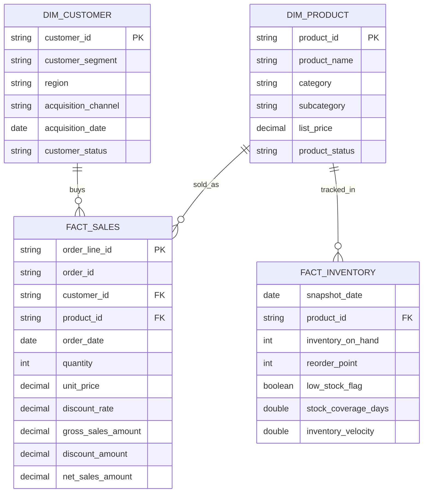
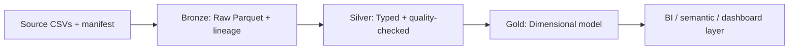

# Phase 1 Lakehouse Schema Model

## Overview
This document defines the Phase 1 schema model used by the local lakehouse pipeline. The pipeline follows the source -> bronze -> silver -> gold pattern and keeps the business semantics aligned with the validated source contract and downstream analytical usage.

## Source Layer (`lakehouse/source`)
Source files are generated from the P1-U1 deterministic synthetic dataset.

### Input entities
- `customers.csv`
- `products.csv`
- `orders.csv`
- `order_lines.csv`
- `inventory_snapshots.csv`
- `manifest.json`

### Source contract summary
- each file is UTF-8 CSV
- all files are validated against the source manifest
- manifest includes checksum, counts, validation status, and source metadata

## Bronze Layer (`lakehouse/bronze`)
Bronze is the raw ingest layer. It preserves original row values and appends lineage metadata.

### Bronze table structure
- `customers_bronze` / `customers.parquet`
  - raw customer columns
  - lineage: `source_file`, `source_row_number`, `source_run_id`, `ingested_at`
- `products_bronze` / `products.parquet`
- `orders_bronze` / `orders.parquet`
- `order_lines_bronze` / `order_lines.parquet`
- `inventory_snapshots_bronze` / `inventory_snapshots.parquet`

### Bronze contract
- raw values are preserved
- file-level checksum validation is mandatory before load
- no business transformation occurs here

## Silver Layer (`lakehouse/silver`)
Silver is a typed and quality-checked layer derived from Bronze.

### Silver entities
- `customers.parquet`
- `products.parquet`
- `orders.parquet`
- `order_lines.parquet`
- `inventory_snapshots.parquet`

### Silver type and quality contract
- dates are standardized to `DATE`
- decimals are standardized to `DECIMAL`
- row lineage is preserved
- null, duplicate, foreign-key, and domain quality checks are enforced before downstream use

## Gold Layer (`lakehouse/gold`)
Gold represents business-ready analytical tables and sample outputs.

### Gold entities
- `sales_gold.parquet`
  - grain: order line
  - measures: gross sales, discount, net sales
- `customers_gold.parquet`
  - grain: customer profile
- `products_gold.parquet`
  - grain: product dimension
- `inventory_gold.parquet`
  - grain: product-day snapshot

### Gold semantics
- sales are derived at the order-line grain
- inventory is derived at product-day grain
- customer and product outputs are analytical dimension tables

## Dimensional model implemented
The Phase 1 Gold layer uses a lightweight star schema centered on a sales fact table with customer and product dimensions. A separate inventory fact table supports daily product health analysis. The model is intentionally simple for the local PoC while still matching a valid dimensional design pattern.

### Fact and dimension mapping
- `sales_gold.parquet` = fact table at order-line grain
- `customers_gold.parquet` = customer dimension
- `products_gold.parquet` = product dimension
- `inventory_gold.parquet` = inventory fact at product-day grain
- Date is represented directly using the `order_date` and `snapshot_date` fields rather than a separate persisted date dimension in this PoC
- Optional future enhancement: add a persisted `dim_date` table to support date-based slicers and calendar semantics beyond the minimal Phase 1 implementation

### Dimensional diagram

## Pipeline diagram

## Phase 1 validation summary
The validated pipeline flow is:
- source generation from P1-U1
- Bronze ingestion from source via U2
- Silver standardization and quality checks via U3
- Gold analytical publication via U4
- dimensional model validation via fact and dimension row counts, referential checks, and sample business queries
